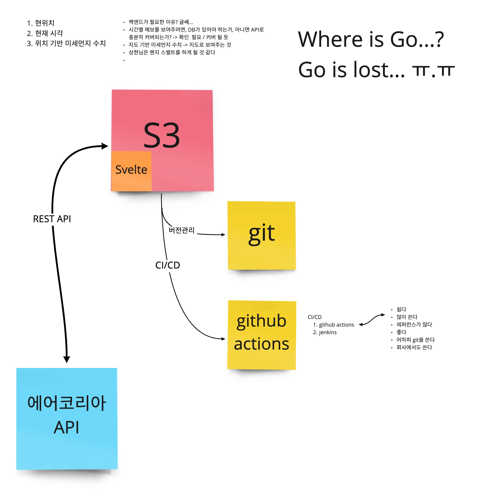

# 220605

## 주제: 기획 및 아키텍처 구상

### 1. 필요한 기능(뷰)

1. 현위치 보여주고,
2. 현재 시각 보여주고,
   - 또는 측정 기준 시각
3. 위치 기반 미세먼지 수치 보여준다.

### 2. _폭탄선언! 백엔드는 필요없다_

- 위의 기능을 넣는 데 반드시 DB가 필요한가? - No
- 추후 시간별 예보를 보여준다고 가정하면, DB 없이 API로 커버가 가능한가? - YES
  - https://www.data.go.kr/data/15073861/openapi.do
- 지도 기반 미세먼지 수치를 보여주는 것 역시 마찬가지
- 결론: 상현 님은 **Go**가 아니라 **Svelte**를 하게 될 것 같다.

### 3. 아키텍처

